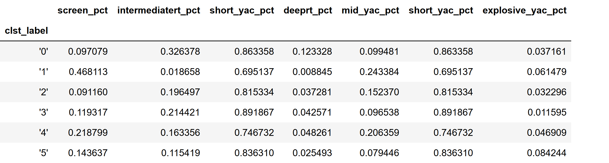

# NFL Receiver Clusters 

```
## Introduction

The Nfl has transitioned to a passing league over the last decade. More than ever before pass records are being broken. In this project I wanted to see if I could make useful clusters using the Air Yards and Yards after catch statistics.  
```

```
## Data Overview
This dataset was scrapped from the website profootballrefrence with the aid of Ryurko R wrapper which makes simple to pull stats from the website. I used the play by play data of three seasons. 

The dataset contains 45546 plays and is accompanied by 256 columns.
```





